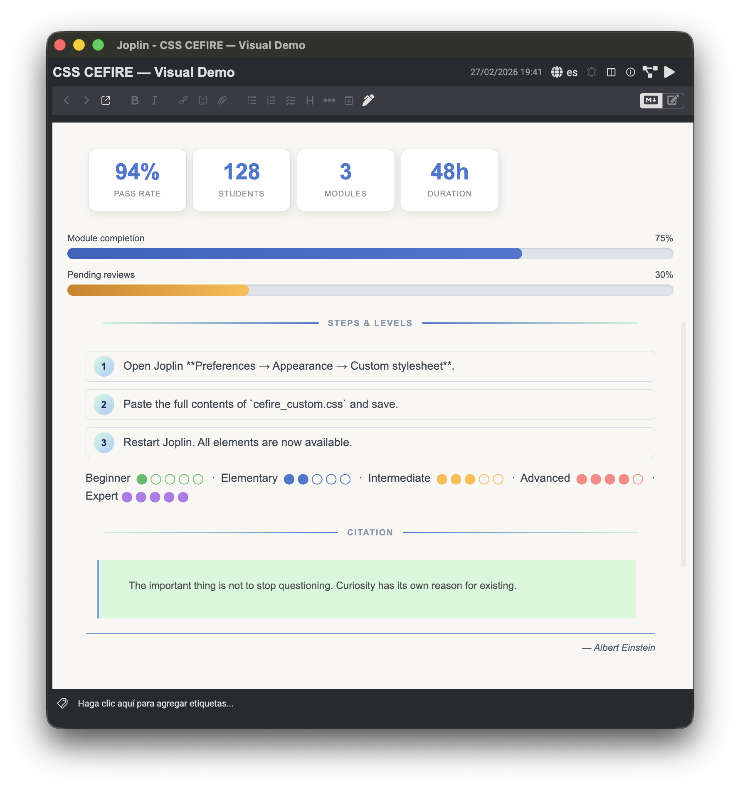
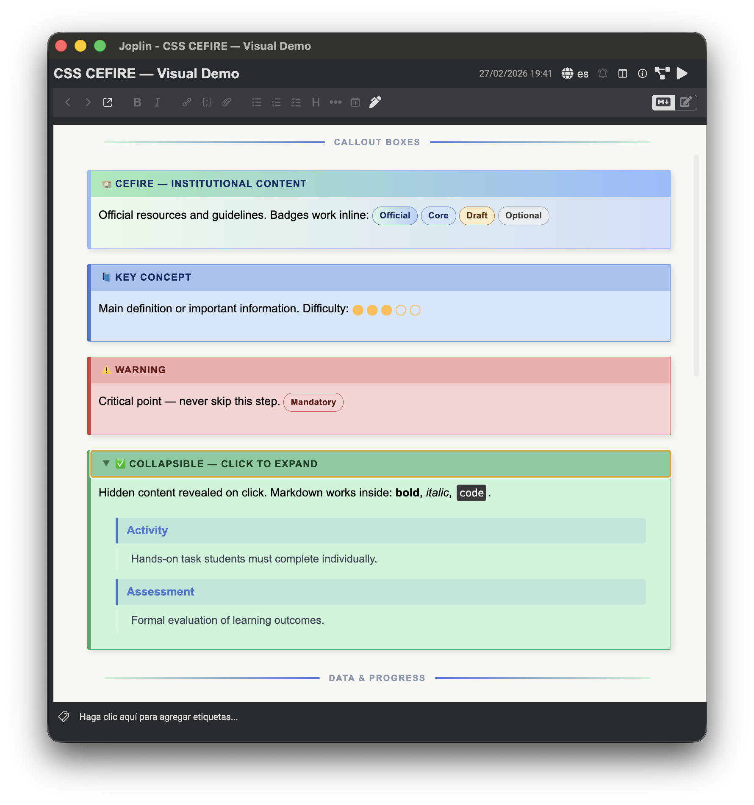

# CEFIRE CSS — Custom Joplin Stylesheet

[CEFIRE](https://portal.edu.gva.es/cefire/) is the **Centro de Formación del Profesorado de la Comunitat Valenciana** (Spain) — the regional teacher training centre. This stylesheet was created to adapt Joplin's note rendering to CEFIRE's corporate visual identity for producing training and instructional materials.

The code is released freely for anyone wishing to adapt it to a different corporate palette or visual identity.

**Design philosophy:** the goal is to maintain a balance between the simplicity of Markdown and the introduction of a minimal set of HTML elements that add visual richness and improve the presentation of materials in line with Instructional Design principles.

## Preview




## Color Palette

CSS custom properties power the entire theme. The corporate CEFIRE gradient (`#cdffd8` → `#93b9ff`) is preserved for `h1`, `h2` headings and horizontal rules.

| Variable | Value | Role |
|---|---|---|
| `--primary-color` | `#4070cc` | h3–h6, links, accents |
| `--text-color` | `#333c4a` | Body text |
| `--bg-color` | `#f8f7f2` | Page background |
| `--block-bg-color` | `#c0f5d0` | Mint accent, blockquotes |
| `--link-color` | `#0050bb` | Hyperlinks |

## New Elements (v2.0)

### 1. Callout Boxes with Integrated Title (`b-title`)

Add a styled header strip to any callout box by placing `<b-title>` as the first child.

```html
<b-blue>
  <b-title>Important Note</b-title>
  Content goes here.
</b-blue>
```

Available box colors: `b-gray` `b-green` `b-red` `b-blue` `b-orange` `b-purple` `b-pink` `b-cefire`

### 2. Collapsible Box with Styled Title

Combine `<details>`/`<summary>` with `<b-title>` for an expandable box that keeps the styled header. The disclosure arrow is integrated inside the title strip.

```html
<div><b-cefire>
  <details>
    <summary><b-title>🔥 More on this topic</b-title></summary>
    Content in **Markdown** here...
  </details>
</b-cefire></div>
```

### 3. Progress Bars

```html
<div class="pbar-label"><span>Reading progress</span><span>70%</span></div>
<div class="pbar"><div class="pfill pfill-blue" style="width:70%"></div></div>
```

Fill color classes: `pfill-blue` `pfill-green` `pfill-orange` `pfill-red` `pfill-purple`

### 4. Stat Boxes

Inline metric cards ideal for key figures and KPIs.

```html
<stat-box><stat-num>128</stat-num><stat-label>Students</stat-label></stat-box>
<stat-box><stat-num>94%</stat-num><stat-label>Pass rate</stat-label></stat-box>
```

### 5. Badges / Inline Labels

Small inline pills for tagging content.

```html
<badge-green>Completed</badge-green>
<badge-orange>In progress</badge-orange>
<badge-red>Pending</badge-red>
```

Available colors: `badge-green` `badge-red` `badge-blue` `badge-orange` `badge-gray` `badge-purple` `badge-pink` `badge-cefire`

### 6. Numbered Steps

Auto-numbered steps using CSS counters — no manual numbering needed.

```html
<steps>
  <step>Install the plugin</step>
  <step>Open the settings panel</step>
  <step>Apply the stylesheet</step>
</steps>
```

### 7. Section Divider with Label

A decorative horizontal rule with a centered text label, flanked by gradient lines.

```html
<sec-label>Prerequisites</sec-label>
```

### 8. Level Indicator

Five-dot visual scale, useful for difficulty ratings or skill levels.

```html
Difficulty: <nivel-3></nivel-3>
Advanced:   <nivel-5></nivel-5>
```

Levels: `nivel-1` (beginner) → `nivel-5` (expert)

### 9. Author Citation

A right-aligned italic attribution line with an automatic em dash.

```html
<cite-author>John Dewey, Experience and Education</cite-author>
```

### 10. Definition List Styling

Compatible with Joplin's `markdown-it-deflist` plugin. Terms and definitions are automatically styled.

```
Term one
: Definition of term one

Term two
: Definition of term two
```

### 11. Auto-numbered Table of Contents

When using `[[toc]]`, the TOC reflects the same hierarchical numbering as the headings (`h2` → `"1."`, `h3` → `"1.1."`, etc.). H1 acts as the unnumbered document title.

Add to your note:

```
[[toc]]
```

## Usage

### Option A — Global stylesheet

Paste the contents of `cefire_custom.css` into **Joplin → Preferences → Appearance → Custom stylesheet for rendered Markdown**.

### Option B — Per-note import

Create a dedicated Joplin note with the CSS content and import it selectively into any note using:

```html
<style>@import ":/<NOTE_ID>";</style>
```

This method requires the [**Import Local CSS**](https://joplinapp.org/plugins/plugin/io.github.personalizedrefrigerator.import-local-css/) plugin.

## Changelog

| Version | Description |
|---|---|
| 2.0 | Accessible color palette (WCAG AA), `b-title`, collapsible boxes, progress bars, stat boxes, badges, numbered steps, `sec-label`, level indicators, author citations, deflist styling, auto-numbered TOC |
| 1.0 | Base stylesheet — callout boxes, details/summary, heading counters, tables, code blocks, Mermaid diagrams |
